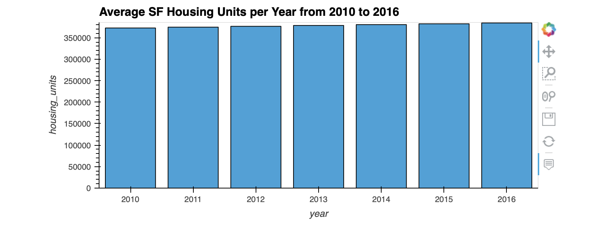

# SFO_Rental_Analysis

## Background
This project is for Proptech company which wants to provide customers with a broader range of portfolio options for the San Francisco market. I have built a dashboard to display this. 

The goal of this dashboard is to provide charts, maps, and interactive visualizations that help customers explore the data and determine if they want to invest in rental properties in San Francisco.

---
### Rental Analysis

The first step to building the dashboard is to work out all of the calculations and visualizations in an analysis notebook. Once the code is worked out here, it can be copied over to a dashboard code and used with Panel to create the final layout.

#### Housing Units Per Year

Calculated the number of housing units per year and visualize the results as a bar chart using the Pandas plot function.

Default Bar Chart

  

Bar Chart with y-axis limits adjusted

  
